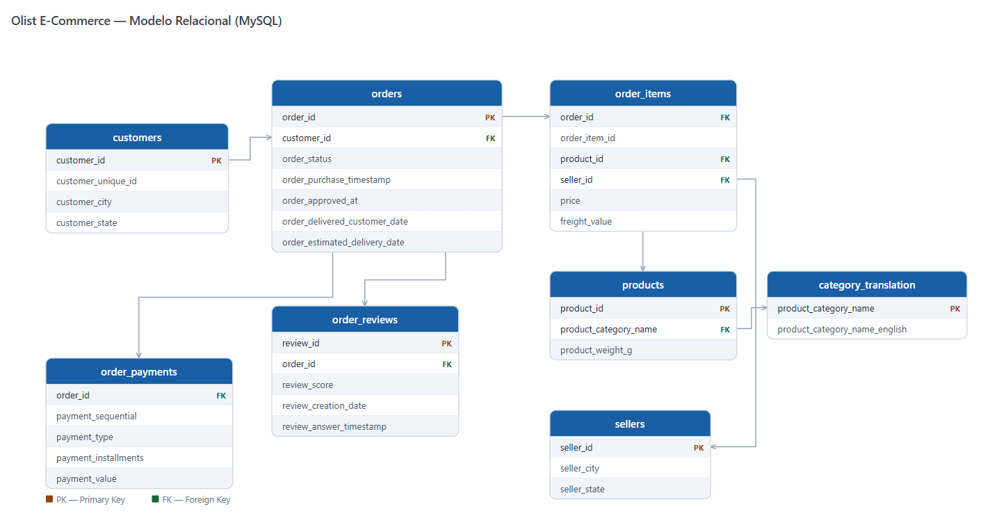

# Análisis de E-Commerce — Olist Brasil

---

### Descripción general

Este proyecto forma parte de un portafolio de análisis de datos orientado a demostrar
competencias en extracción, agrupación, inspección, limpieza, transformación, análisis y comunicación de hallazgos utilizando
SQL y Excel. El análisis se realiza sobre el dataset público de Olist, una plataforma
brasileña de e-commerce que conecta pequeños comerciantes con los principales marketplaces
del país.

El objetivo no es solo demostrar dominio técnico de las herramientas, sino responder
una pregunta de negocio concreta a través de un análisis estructurado con narrativa clara.

---

### Pregunta de negocio

> **¿Olist está creciendo bien o está creciendo mal?**

Las ventas de Olist crecieron en volumen entre 2016 y 2018, pero simultáneamente
aumentaron las quejas de clientes. Este análisis busca determinar si el crecimiento
en volumen de ventas está comprometiendo la calidad del servicio, identificar dónde se concentran
los problemas y proponer en qué áreas enfocar la atención.

---

### Modelo relacional



La tabla central es `orders` — casi toda la información del negocio pasa por ella.
A partir de ahí se conectan las demás entidades del modelo:

**customers** — Registra a cada cliente único que realizó al menos una compra.
- `customer_id` — identificador de la cuenta del cliente.
- `customer_unique_id` — identificador del cliente a nivel persona.
- `customer_zip_code` — código postal del cliente.
- `customer_city` — ciudad de residencia del cliente.
- `customer_state` — estado de residencia del cliente.

**orders** — Registra el ciclo de vida completo de cada orden desde la compra hasta la entrega.
- `order_id` — identificador único de la orden.
- `customer_id` — referencia al cliente que realizó la compra.
- `order_status` — estado actual de la orden: `delivered`, `shipped`, `canceled`, entre otros.
- `order_purchase_timestamp` — fecha y hora en que el cliente realizó la compra.
- `order_approved_at` — fecha y hora en que el pago fue aprobado.
- `order_delivered_carrier_date` — fecha en que la orden fue entregada al transportista.
- `order_delivered_customer_date` — fecha en que la orden llegó al cliente.
- `order_estimated_delivery_date` — fecha de entrega prometida al cliente al momento de la compra.

**order_items** — Registra cada producto dentro de una orden. Una orden puede contener múltiples productos de distintos vendedores.
- `order_id` — referencia a la orden a la que pertenece el ítem.
- `order_item_id` — número secuencial del ítem dentro de la orden.
- `product_id` — referencia al producto comprado.
- `seller_id` — referencia al vendedor que despachó el ítem.
- `shipping_limit_date` — fecha límite para que el vendedor despache el producto.
- `price` — precio del producto en reales brasileños.
- `freight_value` — costo de envío del ítem en reales brasileños.

**order_payments** — Registra la información de pago de cada orden. Una orden puede tener múltiples registros si el cliente usó más de un método de pago.
- `order_id` — referencia a la orden pagada.
- `payment_sequential` — número secuencial del pago dentro de la orden.
- `payment_type` — método de pago: `credit_card`, `boleto`, `voucher`, `debit_card`.
- `payment_installments` — número de cuotas en que se dividió el pago.
- `payment_value` — valor pagado en reales brasileños (BRL).

**order_reviews** — Registra las calificaciones y comentarios que los clientes dejan después de recibir su orden.
- `review_id` — identificador único de la reseña.
- `order_id` — referencia a la orden evaluada.
- `review_score` — calificación del cliente del 1 (muy malo) al 5 (excelente).
- `review_comment_title` — título corto del comentario en portugués (opcional).
- `review_comment_message` — comentario extendido del cliente en portugués (opcional).
- `review_creation_date` — fecha en que se envió la solicitud de reseña al cliente.
- `review_answer_timestamp` — fecha en que el cliente respondió la reseña.

**products** — Catálogo de todos los productos disponibles en la plataforma.
- `product_id` — identificador único del producto.
- `product_category_name` — categoría del producto en portugués.
- `product_name_length` — número de caracteres en el nombre del producto.
- `product_description_length` — número de caracteres en la descripción del producto.
- `product_photos_qty` — cantidad de fotos del producto.
- `product_weight_g` — peso del producto en gramos.
- `product_length_cm` — longitud del producto en centímetros.
- `product_height_cm` — altura del producto en centímetros.
- `product_width_cm` — ancho del producto en centímetros.

**sellers** — Registra a cada vendedor que opera dentro de la plataforma de Olist.
- `seller_id` — identificador único del vendedor.
- `seller_zip_code` — código postal del vendedor.
- `seller_city` — ciudad donde opera el vendedor.
- `seller_state` — estado donde opera el vendedor.

**category_translation** — Tabla de referencia que traduce los nombres de categorías
del portugués al inglés. Se usa para hacer el análisis más legible.
- `product_category_name` — nombre de la categoría en portugués (clave primaria).
- `product_category_name_english` — nombre de la categoría en inglés.

---

### Dataset

**Fuente:** [Brazilian E-Commerce Public Dataset by Olist](https://www.kaggle.com/datasets/olistbr/brazilian-ecommerce)  
**Periodo cubierto:** 2016 – 2018  
**Tablas:** 8  
**Registros totales:** ~530,000  

| Tabla | Registros | Descripción |
|---|---|---|
| customers | 99,441 | Clientes únicos con ubicación geográfica |
| orders | 99,441 | Órdenes con estado y fechas del ciclo de entrega |
| order_items | 112,650 | Productos incluidos en cada orden |
| order_payments | 103,886 | Métodos y valores de pago por orden |
| order_reviews | 98,409 | Calificaciones y comentarios de clientes |
| products | 32,951 | Catálogo de productos con categoría y dimensiones |
| sellers | 3,095 | Vendedores con ubicación geográfica |
| category_translation | 71 | Traducción de categorías del portugués al inglés |

---

### Herramientas

| Herramienta | Uso |
|---|---|
| MySQL | Almacenamiento, limpieza y extracción de datos mediante SQL |
| HeidiSQL | Cliente de base de datos para ejecución de queries |
| Excel | Análisis estadístico descriptivo y visualizaciones |

---

### Estructura del repositorio

```
ecommerce-sales-analysis/
├── README.md
├── docs/
│   └── setup_notes.md        # Problemas encontrados durante la carga y soluciones implementadas
│   └── eda_notes.md          # Documentación sobre cada query ejecutada durante el EDA
│   └── erd_olist.png         # Imágen del modelo relacional de la base de datos
├── sql/
│   └── queries.sql           # Todas las consultas documentadas con su pregunta de negocio
├── data/
│   └── output.csv            # Dataset consolidado exportado desde SQL
└── excel/
    └── dashboard.xlsx        # Análisis estadístico y visualizaciones
```

---

### Narrativa del análisis

El análisis se desarrolla en tres actos que responden preguntas encadenadas:

**Acto 1 — ¿Cómo están las ventas?**  
Establecer la línea base del negocio: volumen de órdenes, ingresos por periodo
y categorías principales. Este acto describe el negocio con datos antes de emitir
cualquier juicio sobre él.

**Acto 2 — ¿Dónde está el problema?**  
Cruzar ventas con calificaciones de clientes y tiempos de entrega para identificar
si el problema es el producto, el precio o la logística.

**Acto 3 — ¿Dónde enfocar la solución?**  
Segmentar el problema geográficamente para identificar dónde se concentra la
fricción y qué acciones tendrían mayor impacto.

---

### Preguntas que guían el análisis

| # | Pregunta | Acto |
|---|---|---|
| 1 | ¿Cuál es el ingreso total y número de órdenes por mes? | 1 |
| 2 | ¿Cuáles son las 10 categorías con más ingresos? | 1 |
| 3 | ¿Cuál es el ticket promedio por categoría? | 1 |
| 4 | ¿Cómo se distribuyen las calificaciones de clientes? | 2 |
| 5 | ¿Qué categorías tienen peor calificación promedio? | 2 |
| 6 | ¿Cuántos días tarda en promedio cada categoría en entregarse? | 2 |
| 7 | ¿Hay correlación entre tiempo de entrega y calificación? | 2 |
| 8 | ¿Qué estados concentran los peores tiempos de entrega? | 3 |
| 9 | ¿Cuál es la tasa de órdenes entregadas vs canceladas? | 3 |
| 10 | ¿Qué vendedores tienen más volumen pero peor calificación? | 3 |

---

### Estado del proyecto

- [x] Configuración de la base de datos en MySQL
- [x] Carga y validación de los 8 archivos del dataset
- [ ] Análisis exploratorio con SQL — inspección, limpieza y transformación
- [ ] Análisis estadístico y visualizaciones en Excel
- [ ] Comunicación de hallazgos

---

### Hallazgos principales

*Esta sección se completará al finalizar el análisis.*

---

### Conclusiones y recomendaciones

*Esta sección se completará al finalizar el análisis.*

---

### Sobre el autor

Analista de datos en formación con background en desarrollo de aplicaciones web.
Este proyecto forma parte de un portafolio orientado a demostrar competencias
en el ciclo completo de análisis de datos: extracción, limpieza, análisis y
comunicación de resultados.

📧 *tu correo*  
💼 *tu LinkedIn*  
🐙 *tu GitHub*
