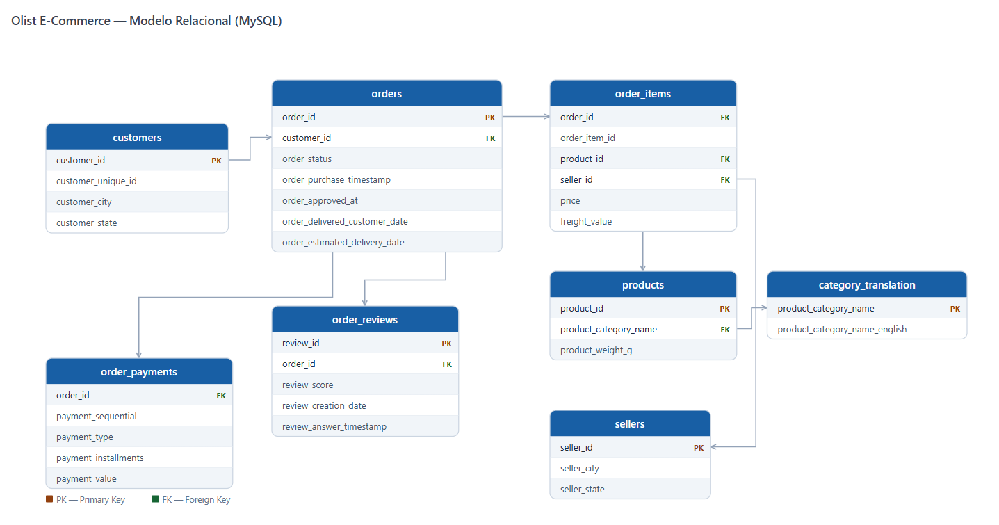

# Análisis de E-Commerce — Olist Brasil

---

### Descripción general

Este proyecto forma parte de un portafolio orientado a demostrar
competencias en extracción, agrupación, inspección, limpieza, transformación, análisis y comunicación de hallazgos utilizando
SQL y Python. El análisis se realiza sobre el dataset público de Olist, una plataforma
brasileña de e-commerce que conecta pequeños comerciantes con los principales marketplaces
del país.

El objetivo no es solo demostrar dominio técnico de las herramientas, sino responder
una pregunta de negocio concreta a través de un análisis estructurado con narrativa clara.

---

### Pregunta de negocio

> **¿Olist está creciendo bien o está creciendo mal?**

Las ventas de Olist crecieron en volumen entre 2016 y 2018, pero simultáneamente
aumentaron las quejas de clientes. Este análisis busca determinar si el crecimiento
en volumen de ventas está comprometiendo la calidad del servicio, identificar dónde se concentran
los problemas y proponer en qué áreas enfocar la atención.

---

### Modelo relacional



La tabla central es `orders`, casi toda la información del negocio pasa por ella.
A partir de ahí se conectan las demás entidades del modelo:

**customers** — Registra a cada cliente único que realizó al menos una compra.
- `customer_id` — identificador de la cuenta del cliente.
- `customer_unique_id` — identificador del cliente a nivel persona.
- `customer_zip_code` — código postal del cliente.
- `customer_city` — ciudad de residencia del cliente.
- `customer_state` — estado de residencia del cliente.

**orders** — Registra el ciclo de vida completo de cada orden desde la compra hasta la entrega.
- `order_id` — identificador único de la orden.
- `customer_id` — referencia al cliente que realizó la compra.
- `order_status` — estado actual de la orden: `delivered`, `shipped`, `canceled`, entre otros.
- `order_purchase_timestamp` — fecha y hora en que el cliente realizó la compra.
- `order_approved_at` — fecha y hora en que el pago fue aprobado.
- `order_delivered_carrier_date` — fecha en que la orden fue entregada al transportista.
- `order_delivered_customer_date` — fecha en que la orden llegó al cliente.
- `order_estimated_delivery_date` — fecha de entrega prometida al cliente al momento de la compra.

**order_items** — Registra cada producto dentro de una orden. Una orden puede contener múltiples productos de distintos vendedores.
- `order_id` — referencia a la orden a la que pertenece el ítem.
- `order_item_id` — número secuencial del ítem dentro de la orden.
- `product_id` — referencia al producto comprado.
- `seller_id` — referencia al vendedor que despachó el ítem.
- `shipping_limit_date` — fecha límite para que el vendedor despache el producto.
- `price` — precio del producto en reales brasileños.
- `freight_value` — costo de envío del ítem en reales brasileños.

**order_payments** — Registra la información de pago de cada orden. Una orden puede tener múltiples registros si el cliente usó más de un método de pago.
- `order_id` — referencia a la orden pagada.
- `payment_sequential` — número secuencial del pago dentro de la orden.
- `payment_type` — método de pago: `credit_card`, `boleto`, `voucher`, `debit_card`.
- `payment_installments` — número de cuotas en que se dividió el pago.
- `payment_value` — valor pagado en reales brasileños (BRL).

**order_reviews** — Registra las calificaciones y comentarios que los clientes dejan después de recibir su orden.
- `review_id` — identificador único de la reseña.
- `order_id` — referencia a la orden evaluada.
- `review_score` — calificación del cliente del 1 (muy malo) al 5 (excelente).
- `review_comment_title` — título corto del comentario en portugués (opcional).
- `review_comment_message` — comentario extendido del cliente en portugués (opcional).
- `review_creation_date` — fecha en que se envió la solicitud de reseña al cliente.
- `review_answer_timestamp` — fecha en que el cliente respondió la reseña.

**products** — Catálogo de todos los productos disponibles en la plataforma.
- `product_id` — identificador único del producto.
- `product_category_name` — categoría del producto en portugués.
- `product_name_length` — número de caracteres en el nombre del producto.
- `product_description_length` — número de caracteres en la descripción del producto.
- `product_photos_qty` — cantidad de fotos del producto.
- `product_weight_g` — peso del producto en gramos.
- `product_length_cm` — longitud del producto en centímetros.
- `product_height_cm` — altura del producto en centímetros.
- `product_width_cm` — ancho del producto en centímetros.

**sellers** — Registra a cada vendedor que opera dentro de la plataforma de Olist.
- `seller_id` — identificador único del vendedor.
- `seller_zip_code` — código postal del vendedor.
- `seller_city` — ciudad donde opera el vendedor.
- `seller_state` — estado donde opera el vendedor.

**category_translation** — Tabla de referencia que traduce los nombres de categorías
del portugués al inglés. Se usa para hacer el análisis más legible.
- `product_category_name` — nombre de la categoría en portugués (clave primaria).
- `product_category_name_english` — nombre de la categoría en inglés.

---

### Dataset

**Fuente:** [Brazilian E-Commerce Public Dataset by Olist](https://www.kaggle.com/datasets/olistbr/brazilian-ecommerce)  
**Periodo cubierto:** 2016 – 2018  
**Tablas:** 8  
**Registros totales:** ~530,000  

| Tabla | Registros | Descripción |
|---|---|---|
| customers | 99,441 | Clientes únicos con ubicación geográfica |
| orders | 99,441 | Órdenes con estado y fechas del ciclo de entrega |
| order_items | 112,650 | Productos incluidos en cada orden |
| order_payments | 103,886 | Métodos y valores de pago por orden |
| order_reviews | 98,409 | Calificaciones y comentarios de clientes |
| products | 32,951 | Catálogo de productos con categoría y dimensiones |
| sellers | 3,095 | Vendedores con ubicación geográfica |
| category_translation | 71 | Traducción de categorías del portugués al inglés |

---

### Herramientas

| Herramienta | Uso |
|---|---|
| MySQL | Almacenamiento, limpieza y extracción de datos mediante SQL |
| HeidiSQL | Cliente de base de datos para ejecución de queries |
| Python | Creación de visualizaciones |
| JS y HTML | Creación de dashboard |

---

### Estructura del repositorio

```
ecommerce-sales-analysis/
├── datos/                        # Archivos CSV intermedios (exportados de MySQL)
│   ├── calificacion_por_tiempo_entrega.csv
│   ├── distribucion_calificaciones.csv
│   ├── tiempo_entrega_por_estado.csv
│   ├── vendedores_criticos.csv
│   └── ventas_mensuales.csv
├── sql/                          # Scripts SQL numerados en orden de ejecución
│   ├── 01_creacion_tablas.sql    
│   ├── 02_carga_datos.sql        
│   ├── 03_analisis_eda.sql       
│   ├── 04_vista_limpia.sql     
│   └── 05_consultas_actos.sql    
├── visualizaciones/              # Gráficas generadas por el script de Python
│   ├── 01_ventas_mensuales.html
│   ├── 01_ventas_mensuales.png
│   ├── 02_distribucion_calificaciones.html
│   └── ... (demás archivos HTML y PNG)
├── .gitignore                    # Archivos y carpetas que Git debe omitir
├── index.html                    # Dashboard interactivo
├── visualizaciones.py            # Script de Python para generar los gráficos
├── hallazgos.md                  # Documento detallado de hallazgos que impactan el negocio
└── README.md                     # Presentación general del proyecto
```

---

### Narrativa del análisis

El análisis se desarrolla en tres actos que responden preguntas encadenadas narrativamente:

**Acto 1 — ¿Cómo están las ventas?**  
Establecer la línea base del negocio: volumen de órdenes, ingresos por periodo
y categorías principales. Este acto describe el negocio con datos antes de emitir
cualquier juicio sobre él.

**Acto 2 — ¿Dónde está el problema?**  
Cruzar ventas con calificaciones de clientes y tiempos de entrega para identificar
si el problema es el producto, el precio o la logística.

**Acto 3 — ¿Dónde enfocar la solución?**  
Segmentar el problema geográficamente para identificar dónde se concentra la
fricción y qué acciones tendrían mayor impacto.

---

### Preguntas que guían el análisis

| # | Pregunta | Acto |
|---|---|---|
| 1 | ¿Cuál es el ingreso total y número de órdenes por mes? | 1 |
| 2 | ¿Cuáles son las 10 categorías con más ingresos? | 1 |
| 3 | ¿Cuál es el ticket promedio por categoría? | 1 |
| 4 | ¿Cómo se distribuyen las calificaciones de clientes? | 2 |
| 5 | ¿Qué categorías tienen peor calificación promedio? | 2 |
| 6 | ¿Cuántos días tarda en promedio cada categoría en entregarse? | 2 |
| 7 | ¿Hay correlación entre tiempo de entrega y calificación? | 2 |
| 8 | ¿Qué estados concentran la tasa de ordenes e ingresos más alta? | 3 |
| 9 | ¿Qué estados concentran los peores tiempos de entrega? | 3 |
| 10 | ¿Cuál es la tasa de órdenes entregadas vs canceladas? | 3 |
| 11 | ¿Qué vendedores tienen más volumen pero peor calificación? | 3 |

---

### Estado del proyecto

- [x] Configuración de la base de datos en MySQL - extracción
- [x] Carga y validación de los 8 archivos del dataset - extracción
- [x] EDA y análisis apartir de los actos con SQL - inspección, limpieza, transformación y análisis
- [x] Generación de visualizaciones con Python - carga y visualización
- [x] Comunicación de hallazgos

---

### Hallazgos principales

**Acto 1 — ¿Cómo están las ventas?**  

> **¿Cuál es el ingreso total y número de órdenes por mes?**   
**Hallazgo:** Los datos de 2016 muestran volúmenes muy bajos y falta el mes de noviembre. El crecimiento en 2017 y 2018 es continuo, destacando noviembre de 2017 (Black Friday) con 8,552 órdenes y 1.16 millones de BRL en ingresos. Al final del periodo (septiembre-octubre de 2018), los datos caen de golpe a cero. Hay bajas estacionales predecibles en diciembre, febrero y a mitad de año.  
**Decisión analítica:** Decidí excluir el año 2016 y los meses finales de 2018 (septiembre y octubre) del análisis de tendencias en los gráficos. 2016 representa una fase piloto del negocio y los meses finales de 2018 están incompletos en el dataset. Incluirlos daría una falsa impresión de caída o estancamiento del negocio.

> **¿Cuáles son las 10 categorías con más ingresos?**   
**Hallazgo:** El volumen de órdenes no siempre equivale a más ingresos. La categoría más vendida (`bed_bath_table` con 9,378 órdenes) generó 1.23 millones de BRL, mientras que `watches_gifts` generó más ingresos (1.28 millones de BRL) con casi la mitad de órdenes (5,565) debido a su alto valor unitario. Además, solo 5 categorías concentran el 31% del ingreso total de la empresa.  
**Recomendación:** Sugiero al equipo comercial enfocar la captación de nuevos vendedores en las 5 categorías líderes (belleza, hogar, relojes, accesorios de computación, etc.) para diversificar la oferta en donde la plataforma ya es más rentable.

> **¿Cuál es el ticket promedio por categoría?**  
**Hallazgo:** La categoría con el ticket promedio más alto es `computers` (1,283.98 BRL). Al cruzar esto con el volumen, note que las computadoras se compran poco pero caro, y los accesorios (`computers_accessories`) se compran de forma masiva y económica. Ninguna de las categorías de ticket promedio alto figura en el top de volumen, ya que corresponden a compras planificadas o industriales.   
**Recomendación:** Recomiendo dividir el catálogo en dos estrategias de marketing diferentes: compras rápidas o por impulso (productos de bajo ticket y alta frecuencia) y compras planificadas (productos de alto ticket, que requieren mayor tiempo de decisión).

**Acto 2 — ¿Dónde está el problema?**

> **¿Cómo se distribuyen las calificaciones de clientes?**  
**Hallazgo:** El 79% de las calificaciones son positivas (4 y 5 estrellas), el 8.4% son neutras (3 estrellas) y el 12.6% son insatisfechas (1 y 2 estrellas).  
**Decisión analítica:** Tener más del 10% de calificaciones negativas es un foco rojo en e-commerce. Como en el análisis previo descartamos errores en cobros o precios, mi hipótesis principal es que la insatisfacción se debe a fallas en la entrega.

> **¿Qué categorías tienen peor calificación promedio?**  
**Hallazgo:** Con un filtro de mínimo 50 órdenes para asegurar representatividad, la categoría peor evaluada de Olist es `office_furniture` (muebles de oficina) con un promedio de 3.5 estrellas. El resto del top 10 de peores categorías promedia menos de 4 estrellas y la mayoría son artículos pesados o voluminosos.  
**Decisión analítica:** Este patrón sugiere un problema con el manejo de productos grandes. Apoya la hipótesis logística: los muebles tienen más probabilidades de sufrir daños durante el transporte o tardar más en entregarse.

> **¿Cuántos días tarda en promedio cada categoría en entregarse?**  
**Hallazgo:** `office_furniture` (muebles de oficina) tiene el peor tiempo de entrega de la plataforma, promediando casi 21 días (20.78 días). Categorías de muebles similares también están entre las más lentas para llegar al cliente.  
**Decisión analítica:** Los datos confirman la hipótesis: la mala calificación de los muebles está directamente ligada a la lentitud en la entrega.

> **¿Hay correlación entre tiempo de entrega y calificación?**  
**Hallazgo:** Cuando un pedido llega a tiempo o antes de lo prometido, la calificación promedio es de 4.22 estrellas. Cuando el pedido se retrasa, la calificación se desploma a 2.33 estrellas.  
**Recomendación:** El cliente castiga severamente la promesa rota de la entrega. Para reducir las quejas del 12.6%, la prioridad número uno debe ser mejorar el cumplimiento de las fechas estimadas.

**Acto 3 — ¿Dónde enfocar la solución?**

> **¿Qué estados concentran la tasa de órdenes e ingresos más alta?**  
**Hallazgo:** Sao Paulo (SP) domina ampliamente el mercado con 40,501 órdenes y 5.76 millones de BRL en ingresos. Río de Janeiro (RJ) le sigue con ~2 millones de BRL y Minas Gerais (MG) con ~1.8 millones de BRL.  
**Decisión analítica:** Sao Paulo representa casi la mitad del negocio. Cualquier problema operativo aquí puede comprometer a toda la empresa, por lo que las estrategias de mejora deben priorizar este estado.

> **¿Qué estados concentran los peores tiempos de entrega?**  
**Hallazgo:** Los peores tiempos de entrega están en el norte del país, liderados por Amapá (28.2 días), Roraima (28.1 días) y Amazonas (26.3 días). En contraste, en Sao Paulo los envíos promedian 8.6 días.  
**Recomendación:** El problema de entregas tardías está regionalizado y no afecta al motor del negocio (Sao Paulo). En lugar de reestructurar la logística nacional, la solución más rápida es corregir las fechas de entrega estimadas que se muestran a los clientes del norte en la web, evitando falsas expectativas.

> **¿Cuál es la tasa de órdenes entregadas vs canceladas?**  
**Hallazgo:** El 99.36% de las órdenes (96,478) se entregó con éxito y solo el 0.64% (625) terminó en cancelación.  
**Decisión analítica:** La plataforma es operativamente muy sólida cobrando y procesando compras. Esto confirma que el problema de insatisfacción del cliente ocurre después de la compra (durante el traslado) y no en la fiabilidad del sitio web.

> **¿Qué vendedores tienen más volumen pero peor calificación?**  
**Hallazgo:** Filtrando vendedores con más de 100 órdenes, encontramos casos muy contrastantes. El vendedor `7c67e1448b00f6e969d365cea6b010ab` tiene un volumen de 980 órdenes pero una calificación promedio crítica de ~3.0. Por otro lado, el vendedor `3b15288545f8928d3e65a8f949a28291` mantiene una calificación casi perfecta con poco más de 100 ventas.  
**Recomendación:** Los vendedores grandes con bajas calificaciones dañan la imagen del marketplace. Sugiero implementar alertas automáticas: si un vendedor supera las 100 ventas pero su promedio baja de 3.8 estrellas, se le debe auditar o reducir su visibilidad para proteger la reputación de Olist.

---

### Conclusiones y recomendaciones
Tras un análisis del ecosistema de datos de Olist (2016-2018), se identificaron varios puntos clave donde la empresa puede intervenir para proteger sus ingresos y mejorar la experiencia del cliente:  

> **1. Logística y calificación del cliente"**    
**Conclusión:** La fiabilidad del sitio web y el procesamiento de pagos de Olist es excelente (con una bajísima tasa de cancelación de apenas **0.64%**). Sin embargo, el **12.6%** de los clientes califica su experiencia con 1 o 2 estrellas. El análisis demuestra que la insatisfacción no es por el producto, sino por la logística: cuando una entrega se retrasa, la calificación promedio cae drásticamente de **4.22 a 2.33 estrellas**.  
**Recomendación:** La prioridad número uno debe ser mejorar el cumplimiento de las fechas estimadas de entrega. Asimismo, categorías pesadas como "muebles de oficina" (`office_furniture`) registran los peores tiempos de entrega (~21 días) y la peor calificación promedio (3.5 estrellas), sugiriendo la necesidad de contratar un servicio de transporte especializado para productos voluminosos. 

> **2. Expectativas reales de entrega**
**Conclusión:** El problema logístico aplica diferente segun la región. Mientras que en Sao Paulo (el motor del negocio con más de 40k órdenes) los envíos promedian **8.6 días**, en los estados del Norte como Amapá, Roraima y Amazonas, los tiempos se disparan a casi un mes (**26 a 28 días**).
**Recomendación:** La solución más económica y rápida es **mejorar el calculo de estimación en la web** para los clientes del Norte. Al mostrarles fechas de entrega realistas desde el inicio, se evita romper la promesa de entrega y se neutraliza el castigo en las calificaciones.  

> **3. Control de calidad del marketplace**
**Conclusión:** Existen grandes vendedores con volúmenes masivos de ventas que están dañando la reputación de la plataforma debido a su pésimo servicio. El caso más crítico es el vendedor con ID corto `7c67e144`, quien acumula **980 órdenes** pero tiene una calificación promedio crítica de **~3.0 estrellas**.
**Recomendación:** Implementar un sistema de alertas automatizado. Si un vendedor supera las 100 ventas pero su calificación promedio acumulada cae por debajo de **3.8 estrellas**, su visibilidad en el marketplace debe ser penalizada o pausada hasta que pase una auditoría de servicio.  

>**4. Nuevo enfoque comercial**
**Conclusión:** El volumen de ventas no siempre equivale a mayores ingresos. Categorías de bajo volumen y alto ticket como "computadoras" (`computers`) generan ingresos significativos con pocas transacciones, mientras que los accesorios se venden de forma masiva y económica. Además, solo 5 categorías concentran el **31% del ingreso total** de Olist.
**Recomendación:** Dividir la estrategia de marketing en dos pilares: compras de impulso/frecuencia (artículos de bajo ticket) y compras planificadas (artículos de alto ticket). Alinear los esfuerzos de captación de nuevos vendedores en las 5 categorías líderes para maximizar la rentabilidad de la plataforma.

---

### Sobre el autor
Developer Frontend con gusto por el mundo del data.
Este proyecto forma parte de un portafolio orientado a demostrar competencias
en el ciclo completo de análisis de datos: extracción, limpieza, análisis y
comunicación de resultados.

📧 jorgegonzalo00@gmail.com  
💼 https://www.linkedin.com/in/jorge-gonzalo-hern%C3%A1ndez-44a05524a/
